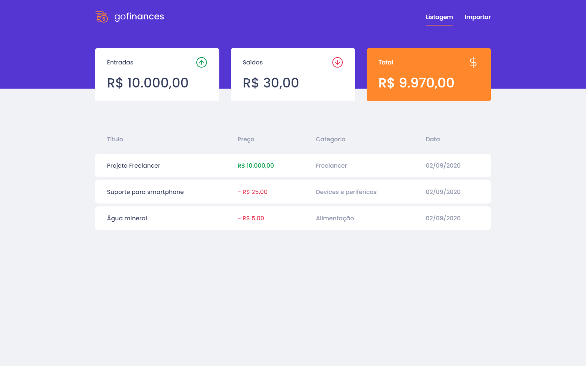
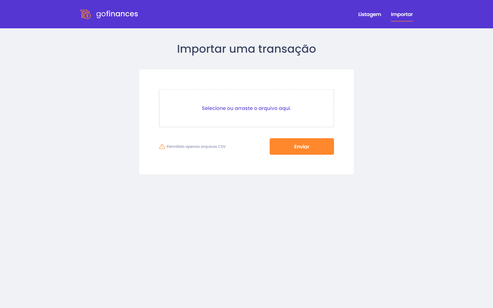

![GoStack Bootcamp][logo]

### Level 03 - Desafio: Fundamentos ReactJS

[📑 Instruções do desafio][challenge]
&nbsp; | &nbsp;
[👨🏻‍🎨 Layout do Figma][layout]

---

### 📷 Screen captures

---

### ⚙ Testes

- [x] - `should be able to list the total balance inside the cards`: Para que esse teste passe, sua aplicação deve permitir que seja exibido na sua Dashboard, cards contendo o total de income, outcome e o total da subtração de income - outcome que são retornados pelo balance do seu backend.

- [x] - `should be able to list the transactions`: Para que esse teste passe, sua aplicação deve permitir que sejam listados dentro de uma tabela, toda as transações que são retornadas do seu backend.
Dica: Para a exibição dos valores na listagem de transações, as transações com tipo income devem exibir os valores no formado R$ 5.500,00. Transações do tipo outcome devem exibir os valores no formado - R$ 5.500,00.

- [x] - `should be able to navigate to the import page`: Para que esse teste passe, você deve permitir a troca de página através do Header, pelo botão que contém o nome Importar.
Dica: Utilize o componente Link que é exportado do react-router-dom, passando a propriedade to que leva para a página /import.

- [x] - `should be able to upload a file`: Para que esse teste passe, você deve permitir que um arquivo seja enviado através do componente de drag-n-drop na página de import, e que seja possível exibir o nome do arquivo enviado para o input.

[logo]: https://github.com/leonardosposina/gostack13-lv01-d01/blob/master/docs/gostack-bootcamp.png?raw=true
[challenge]: https://github.com/rocketseat-education/bootcamp-gostack-desafios/tree/master/desafio-fundamentos-reactjs
[layout]: https://www.figma.com/file/EgOhyj1Inz14dhWGVhRlhr/GoFinances
